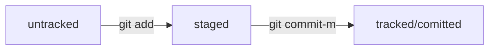

## Навигация

- `pwd` — покажи, в какой я папке;
- `ls` - покажи файлы и папки в текущей папке;
- `ls -a` - покажи также скрытые файлы и папки, названия которых начинаются с символа `.`;
- `cd first-projact` - перейди в папку `first-project`;
- `cd first-project/html` - перейди в папку `html`, которая находится в папке `first-project`;
- `cd ..` - перейди на уровень выше, в родительскую папку;
- `cd ~` - перейди в домашнюю директорию;
- `cd /` - перейди в корневую директорию.

## Работа с файлами и папками

- `touch index.html` - создай файл `index.html` в текущей папке;
- `touch index.html style.css script.js` - если нужно создать несколько файлов сразу, можно напечатать их имена в одну строку через пробел; 
- `mkdir second-project` - создай папку с имененм `second-project` в текущей папке.

### Копирование и перемещение

- `cp file.txt ~/my-dir` - скопируй файл в другое место;
- `mv file.txt ~/my-dir` - перемести файл или папку в другое место. 

### Чтение
- `cat file.txt` - распечатай содержимое файла `file.txt`

### Удаление
- `rm about.html` - удалить файл about.html
- `rmdir images` - удалить папку `images`
- `rm -r second-project` - удалить папку `second-project` и все ее содержимое

## Полезные возможности
- Команды не обязательно печатать и выполнять по очереди. Можно указать их списком - разделить двумя амперсандами `&&`
- У консоли есть собственная память — буфер с несколькими последними командами. По ним можно перемещаться с помощью клавиш со стрелками вверх `↑` и вниз `↓`
- Чтобы не вводить название файла или папки полностью, можно набрать первые символы имени и дважды нажать `Tab`. Если файл или папка есть в текущей директории, командная строка допишет путь сама.

# Инициируем репозиторий
- Инициализировать репозиторий можно с помощью команды `git init`.
- Проверить статус, или состояние, репозитория поможет команда `git status`.
- Если вы ошиблись и случайно инициализировали не ту папку, можно «разгитить» её — удалить скрытую подпапку `.git`.

# Добавляем файлы в репозиторий 
- Команда `git add` позволяет подготовить файл к сохранению.
- Команда `git add --all` подготовит к сохранению сразу все файлы.
- С помощью `git add .` можно добавить в репозиторий текущую папку со всеми файлами.

# Делаем первые коммит
- Коммит можно сделать с помощью команды `git commit`.
- Ключ `-m` позволяет присвоить коммиту сообщение. Помните, что такие сообщения должны быть информативными: чётко описывать изменения.
- Получается форма `git commit -m 'Мой первый коммит!'`

# Хеш - идентификатор коммита
- Git преобразует информацию о коммитах с помощью алгоритма SHA-1 и для каждого из них рассчитывает уникальный идентификатор — хеш.
- Хеш — основной идентификатор коммита и позволяет узнать его автора, дату и содержимое закоммиченных файлов.
- Все хеши, а также таблицу соответствий `хеш → информация о коммите` Git хранит в папке `.git`.

# Исследуем лог. 
- Можно вызвать не только полный лог, но и сокращённый — это делается командой `git log --oneline`.
- В сокращённом логе выводятся сокращённые хеши — их можно использовать точно так же, как и полные.

# HEAD - всему голова
- В числе прочих файлов в папке `.git` есть служебный файл `HEAD`. Он указывает на самый свежий коммит.
- Вместо хеша последнего коммита можно написать слово `HEAD` — Git вас поймёт.

# Статусы файлов в Git
- Статусом `untracked` помечается файл, о существовании которого Git знает, но не следит за изменениями в нём. Этот статус — противоположность `tracked`, в который попадают все файлы, отслеживаемые Git.
- Файл переходит в статус `staged` после выполнения `git add`.
- Статус `modified` означает, что файл был изменён.
- Большинство файлов в проектах «шагает» по следующему циклу: «изменён» → «добавлен в список на коммит» → «закоммичен» → «изменён» → и так далее.

### Схема изменений статусов

